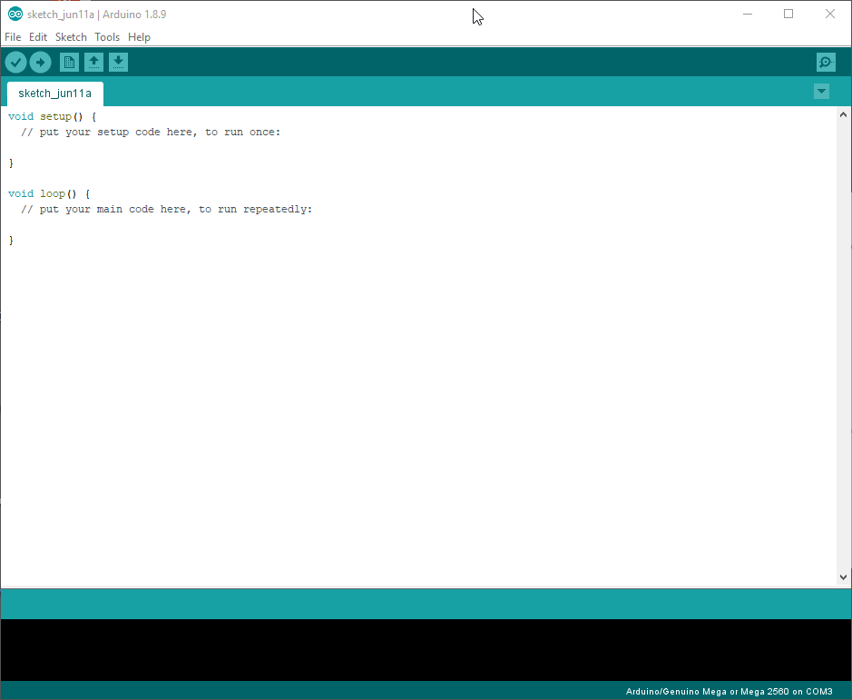

# Servo Hardware PWM Library for Arduino Mega

This library allows Arduino/Genuino Mega boards to control up to **6 servos** with the integrated **16-bit hardware PWM timer/counter**.
This library uses the 16-bit hardware timer/counter (timer3, timer4 and timer5) to control the servos.

Unlike the original Servo.h library, this library does not use timer1.
The advantage here is that when using the Wire.h library no fluctuations in the pulse width occur.
In addition, I/O registers are addressed directly and not via the digitalWrite()-function (as in Servo.h).

Possible output pins are **pin 2, 3, 7, 8, 44,** and **45**. 
**Only Arduino/Genuino Mega boards are supported!**

### Installation
This library can be installed through the Arduino IDE library manager like so:


### Note
Starting from version 1.2.0 this Servo-Library is compatible with all the [original Arduino Servo Library](https://github.com/arduino-libraries/Servo) - commands available. In addition to these "standard"-functions, following commands are added:
* ``` attach(int pin, int min, int max, int defaultPos)``` - Besides the ability of setting the servo pin and the upper and lower pulse width limit, the starting pulse width of the servo can be set with the defaultPos. This allows the servo to start from a user defined angle instead of the middle position.
* ```detachAll()``` - This feature allows to detach all servos at once.

### Built With
* [Visual Studio 2019](https://visualstudio.microsoft.com/) - IDE used for programming
* [Arduino IDE](https://www.arduino.cc/en/Main/Software) - IDE used for programming and testing

### Author
**Daniel Duller** - [dadul96](https://github.com/dadul96)

### License
This project is licensed under the MIT License - see the [LICENSE](LICENSE) file for details

### Acknowledgments
* Inspired by - [original Arduino Servo Library](https://github.com/arduino-libraries/Servo)
* Thanks for helping me to improve my library - [per1234](https://github.com/per1234)
* Screen-GIF recorded with - [ShareX](https://getsharex.com/)
